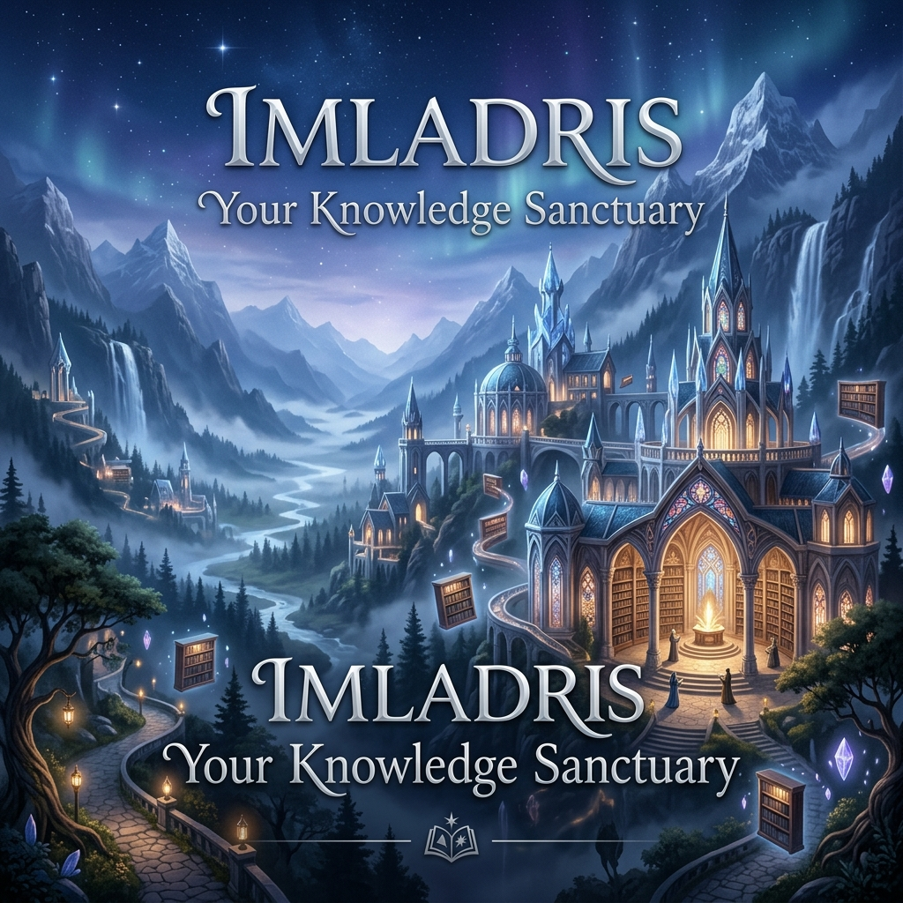
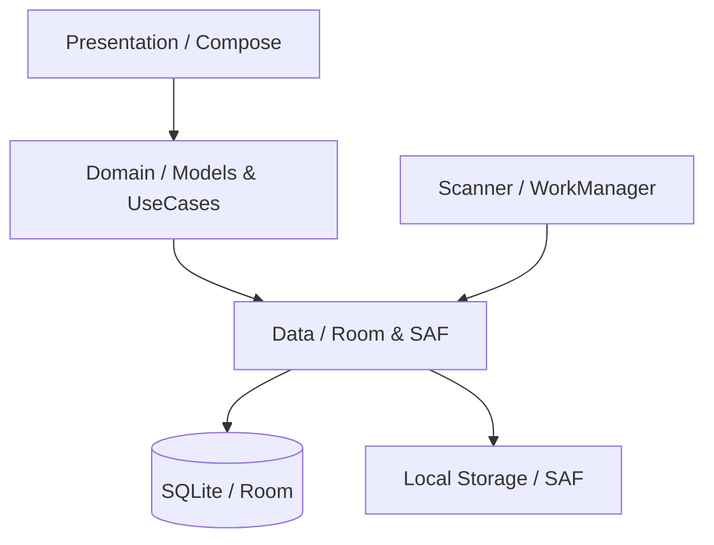

# IMLADRIS

**IMLADRIS** is an ethereal, offline-first Android library and knowledge sanctuary. Inspired by the architectural elegance of Rivendell, it transforms digital bookshelves into a majestic, intelligent space for deep reading and reflection.



## Core Philosophy
Imladris is built upon the concept of a **Mind Palace**. It treats every document not as a file, but as an artifact of knowledge.

- **Spatial Sanctuary**: A UI that breathes. Floating elements, glassmorphic layers, and soft glows create a calm environment that minimizes cognitive load.
- **Neural Wisdom**: The Knowledge Graph visualizes how your ideas interlink, evolving your collection into a living memory system.
- **Privacy by Design**: Fully offline. No cloud syncing, no trackers. Your sanctuary resides entirely within your device via the Android System Access Framework (SAF).

## Technical Architecture
Imladris follows **Clean Architecture** principles to ensure long-term stability and high performance.



## Key Features
- **Spatial UI Engine**: Recursive folder navigation through glowing 'Gateways' and floating 'Artifacts'.
- **Knowledge Graph**: Majestic canvas-based node-link diagram with fluid pan/zoom.
- **Ethereal Reader**: Optimized for focus with Playfair Display (Serif) typography and a dedicated Focus Mode.
- **Intelligent Analytics**: Reading focus scores, intellectual timelines, and session tracking.
- **Memory Recall System**: Context-aware, non-intrusive notifications that resurface highlights.
- **Sanctuary Widgets**: Jetpack Glance integration for immediate session resumption.

## Project Structure
```text
com.imladris
├── core
│   ├── data        # Repositories, Room DB, SAF Scanner
│   ├── domain      # Sealed Domain Models, Repository Interfaces
│   ├── notifications # WorkManager Recall Logic, Notification Channels
│   ├── ui          # Design System, Glassmorphic Components, Spatial Engine
│   └── di          # Hilt Dependency Injection Modules
├── feature
│   ├── hall        # Dashboard / Landing Sanctuary
│   ├── library     # Spatial Folder Browser
│   ├── graph       # Knowledge Visualization Canvas
│   ├── reader      # Ethereal Reading Experience
│   └── analytics   # Knowledge Insights & Timeline
└── ui.navigation   # Type-safe Compose Navigation
```

## Getting Started
### Prerequisites
- Android Studio Iguana (2023.2.1) or newer
- JDK 17
- Android SDK Level 34

### Build & Release
Imladris is configured for automated build management. Upon building, the output artifact is automatically renamed to reflect the current version:
```powershell
# To build the release APK
.\gradlew assembleRelease
# Output: app/build/outputs/apk/release/Imladris-v1.0.apk
```

## Visual Identity
| Sanctuary Icon | Brand Aesthetic |
|---|---|
|  | **Midnight Blue**, **Ancient Silver**, and **Soft Gold** palette. |

## License
MIT License - Copyright (c) 2024 IMLADRIS Open Source Project.

---
"Deep roots are not reached by the frost."
